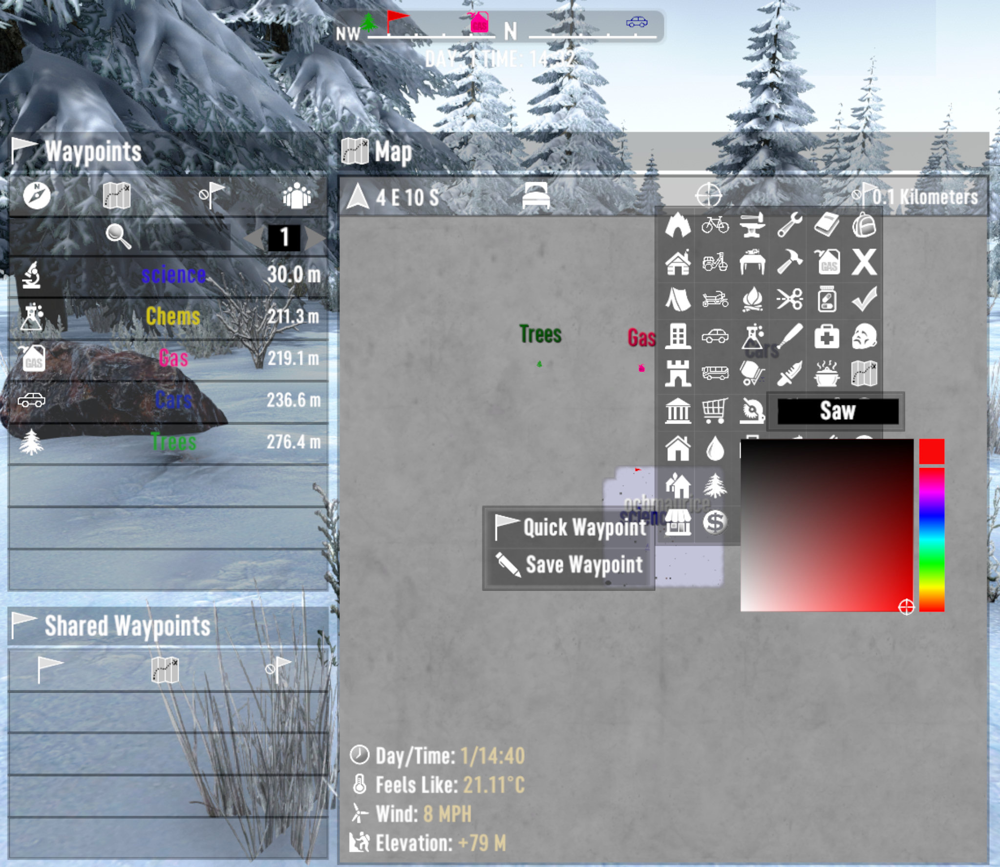

# OCB Way-Point Icons - 7 Days to Die (V1.0 exp) Addon

Custom icons for map waypoints (extendable via xml).

This mod is not EAC (Easy Anti-Cheat) compatible, so turn it off!

## Download and Install

[Download from GitHub releases][2] and extract into your Mods folder!  
Ensure you don't have double nested folders and ModInfo.xml is at right place!

[![GitHub CI Compile Status][4]][3]

## Changelog

### Version 0.4.0

- First compatibility with V1.0 (exp)
- Add small bug with color parsing

### Version 0.3.0

- Update compatibility for 7D2D A21.0(b313)

### Version 0.2.0

- Add color picker to colorize text and icons
- Automated deployment and release packaging

### Version 0.1.0

- Initial version

## Icons licensed under CC-BY 3.0

- Car: https://thenounproject.com/icon/2389506/ (Vectors Point)
- Bus: https://thenounproject.com/icon/4493588/ (SHAHAREA)
- Moped: https://thenounproject.com/icon/3337522/ (Firza Alamsyah)
- Bicycle: https://thenounproject.com/icon/1067030/ (Nico Ilk)
- Motorcycle: https://thenounproject.com/icon/4046333/ (Iconiqu)

[1]: https://github.com/OCB7D2D/A20BepInExPreloader
[2]: https://github.com/OCB7D2D/OcbWayPointIcons/releases
[3]: https://github.com/OCB7D2D/OcbWayPointIcons/actions/workflows/ci.yml
[4]: https://github.com/OCB7D2D/OcbWayPointIcons/actions/workflows/ci.yml/badge.svg
