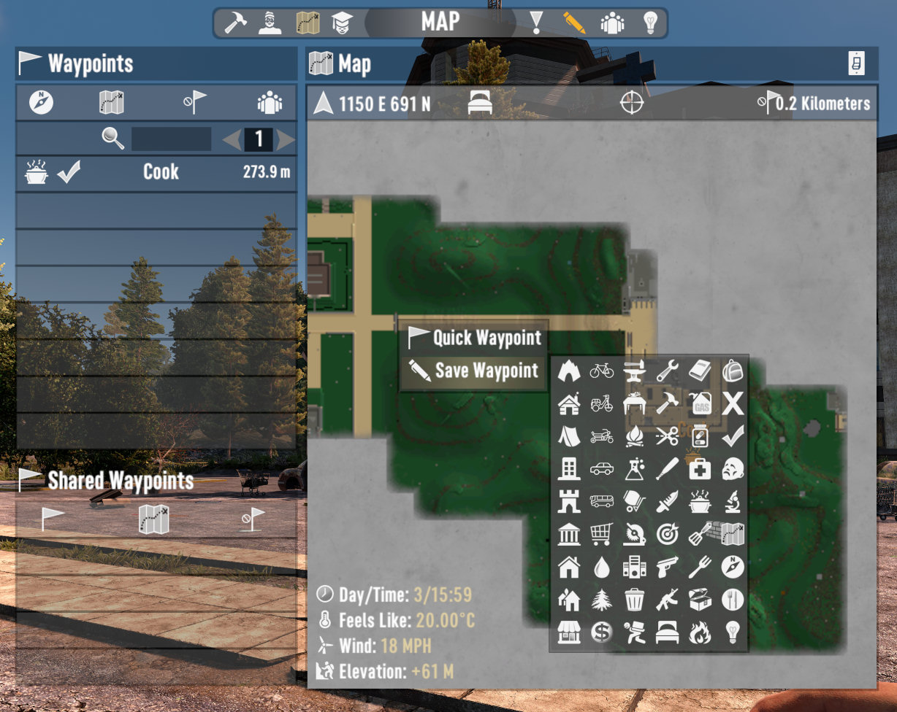

# OCB Way-Point Icons - 7 Days to Die (A20) Addon

Custom icons for map waypoints (extendable via xml).

This mod is not EAC (Easy Anti-Cheat) compatible, so turn it off!

## Changelog

### Version 0.1.0

- Initial version

## Icons licensed under CC-BY 3.0

- Car: https://thenounproject.com/icon/2389506/ (Vectors Point)
- Bus: https://thenounproject.com/icon/4493588/ (SHAHAREA)
- Moped: https://thenounproject.com/icon/3337522/ (Firza Alamsyah)
- Bicycle: https://thenounproject.com/icon/1067030/ (Nico Ilk)
- Motorcycle: https://thenounproject.com/icon/4046333/ (Iconiqu)

## Compatibility

I've developed and tested this Mod against version a20.b218.

[1]: https://github.com/OCB7D2D/A20BepInExPreloader